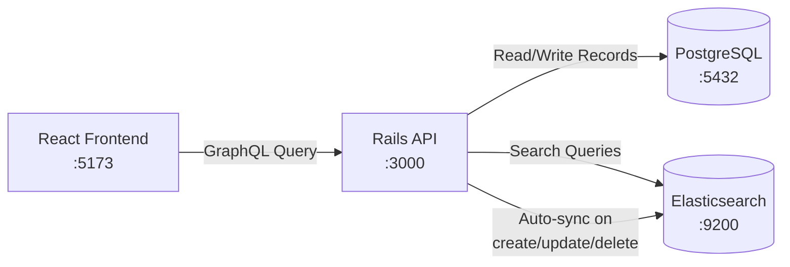

# E-Commerce Product Dashboard

A full-stack e-commerce application featuring products, a shopping cart, and user authentication.

## Tech Stack

*   **Frontend:** React, Vite, Apollo Client, Chakra UI
*   **Backend:** Ruby on Rails, GraphQL (`graphql-ruby`), PostgreSQL
*   **Deployment:** Docker Compose

## Quick Start (Docker)

The easiest way to run the entire application is using Docker. This spins up the database, backend API, and frontend automatically.

1.  Make sure you have Docker installed.
2.  Open a terminal in the project root folder.
3.  Run the following command:

```bash
docker compose up --build
```

**Accessing the apps:**
*   Frontend: `http://localhost:5173`
*   Backend API (Health check): `http://localhost:3000/up`
*   Backend API (GraphQL Playground): `http://localhost:3000/graphiql`

To stop the servers, press `Ctrl+C` in the terminal and then run `docker compose down`.

---

## Running Locally (Without Docker)

If you prefer to run the application directly on your machine, follow these steps.

### 1. Database Setup

Ensure you have PostgreSQL installed and running locally. We use the default `postgres` user with peer authentication (no password required on Linux).

### 2. Backend (Rails API)

1.  Open a terminal.
2.  `cd rails-server`
3.  Install dependencies: `bundle install`
4.  Setup database: `rails db:prepare` (creates the database and runs migrations)
5.  *(Optional)* Seed the database with sample data: `rails db:seed`
6.  Start the server: `rails s`

The API will run on `http://localhost:3000/graphql`.

### 3. Frontend (React)

1.  Open a **new** terminal.
2.  `cd react-client`
3.  Install dependencies: `npm install`
4.  Start the development server: `npm run dev`

The frontend will start on an available port, usually `http://localhost:5173`. Make sure the Rails backend is also running!

## Testing

*   **Backend Tests:** Run `bundle exec rspec` inside the `rails-server` directory.
*   **Frontend Tests:** Run `npm test` inside the `react-client` directory.


<!-- 

Integrate Elasticsearch & Implement Search
This plan outlines how we will complete Day 6 of the learning plan by integrating Elasticsearch into your existing Docker setup, hooking it up dynamically to the Rails Postgres app, and rolling out advanced search filters across the backend and React frontend.

Proposed Changes
1. Docker & Development Setup
We need to add Elasticsearch as a service in your local Docker environment. We will use a single-node Elasticsearch cluster for local development to keep things lightweight.

[MODIFY] docker-compose.yml
Add the elasticsearch container service using the elasticsearch:8.x image.
Set environment variables to disable security & clustering for easy local development (discovery.type=single-node, xpack.security.enabled=false).
Mount a local volume for Elasticsearch data so indexes persist across container restarts.
Add an ELASTICSEARCH_URL environment variable to the api (Rails) service so it knows how to communicate with the newly spun-up Elasticsearch node.
2. Rails Backend Integration
We will use the official Ruby libraries provided by Elastic (elasticsearch-model and elasticsearch-rails) to fully learn the underlying Elasticsearch Query DSL, as required by the success criteria.

[MODIFY] rails-server/Gemfile
Add elasticsearch-model and elasticsearch-rails gems.
[NEW] rails-server/config/initializers/elasticsearch.rb
Initialize the Elasticsearch client using the ELASTICSEARCH_URL we set in the docker-compose setup.
[MODIFY] rails-server/app/models/product.rb
Include Elasticsearch::Model and Elasticsearch::Model::Callbacks so that whenever a Product is created/updated/deleted, Elasticsearch is automatically synchronized.
Generate indexes by defining a mapping (e.g., standard text analyzer for name and description, float for price).
Write a class method (e.g. Product.search_with_filters(query, min_price, max_price)) that explicitly demonstrates Elasticsearch Query DSL. We will use:
multi_match query for fuzzy full-text search.
range query for price filtering combinations.
bool queries to mix matching text and numerical filtering.
[MODIFY] rails-server/lib/tasks/... or db/seeds.rb
Create a quick rake task or script to index existing items (Product.import).
[MODIFY] rails-server/app/graphql/types/query_type.rb (or matching resolver)
Update the products GraphQL query to accept optional arguments: searchQuery, minPrice, maxPrice.
Route the arguments to use the new Product.search_with_filters method instead of the standard ActiveRecord query.
3. React Frontend Implementation (Already Done! ✅)
You have already implemented the Apollo GraphQL query and search/filter UI in ProductList.jsx. We just need to wire that existing products(search: String, maxPrice: Float) GraphQL query to use Elasticsearch instead of ActiveRecord ILIKE %...% on the backend!

User Review Required
IMPORTANT

The search frontend is already built! Do you want to use the official Elastic gems (elasticsearch-model) so we can practice writing explicit Query DSL as planned, or a simpler abstraction gem like searchkick?

Verification Plan
Automated Tests
Verify Elasticsearch health status http://localhost:9200.
Manual Verification
Run docker compose up --build.
Open the React frontend, input a specific search query into the existing search bar, and see the API return only relevant products using the new Elasticsearch mapping instead of Postgres ILIKE.
Apply the price slider to watch the Elasticsearch range DSL dynamically drop items.
Explaining Docker Development Setup

 -->

 walkthrough:
 # Day 6 Walkthrough: Elasticsearch Integration into Rails + Docker

## The Big Picture — What Did We Build?

Before Elasticsearch, your app searched products like this:

```sql
-- Old approach: Postgres ILIKE
SELECT * FROM products WHERE name ILIKE '%laptop%' AND price <= 10000;
```

This has major limitations:
- Only searches the `name` column, misses matches in `description`
- No typo tolerance — searching "laptp" returns **nothing**
- No relevance ranking — results aren't sorted by how well they match
- Gets slower as your data grows

After Elasticsearch, the same search uses a powerful search engine that runs **alongside** your database:

```json
{
  "query": {
    "bool": {
      "must": [{ "multi_match": { "query": "laptop", "fields": ["name^3", "description"], "fuzziness": "auto" }}],
      "filter": [{ "range": { "price": { "lte": 10000 }}}]
    }
  }
}
```

This gives you full-text search across multiple fields, typo tolerance, relevance scoring, and blazing speed.

---

## Architecture — How the Pieces Connect



**Key Insight:** Postgres is still your **source of truth** for all data. Elasticsearch is a **search index** — a copy of your data optimized specifically for searching. When you create/update/delete a product in Postgres, it automatically gets synced to Elasticsearch via model callbacks.

---

## Step 1: Adding Elasticsearch to Docker

### What we changed: [docker-compose.yml](file:///home/someswar/ror-react-learning-plan/docker-compose.yml)

We added a new `elasticsearch` service alongside the existing `db`, `api`, and `web` services:

```yaml
  elasticsearch:
    image: elasticsearch:8.13.0        # Official ES Docker image
    container_name: elasticsearch
    environment:
      - discovery.type=single-node     # ① No clustering needed for dev
      - xpack.security.enabled=false   # ② Disable auth for simplicity
      - xpack.security.enrollment.enabled=false
      - cluster.routing.allocation.disk.threshold_enabled=false  # ③ Prevent disk space warnings
      - ES_JAVA_OPTS=-Xms512m -Xmx512m  # ④ Limit memory to 512MB
    ports:
      - "9200:9200"                    # ⑤ Expose REST API to host
    volumes:
      - elasticsearch_data:/usr/share/elasticsearch/data  # ⑥ Persist index data
```

### Breaking down each environment variable:

| Variable | What it does | Why we need it |
|---|---|---|
| `discovery.type=single-node` | Tells ES this is the only node in the cluster | In production you'd have multiple nodes for redundancy. For local dev, one node is enough |
| `xpack.security.enabled=false` | Disables username/password authentication | ES 8.x enables security by default. We disable it so our Rails app can connect without SSL certificates |
| `xpack.security.enrollment.enabled=false` | Disables the enrollment token flow | Prevents ES from printing security setup warnings on startup |
| `cluster.routing.allocation.disk.threshold_enabled=false` | Disables disk watermark checks | Prevents ES from going read-only if your laptop's disk is >85% full |
| `ES_JAVA_OPTS=-Xms512m -Xmx512m` | Sets Java heap size to 512MB min and max | Elasticsearch runs on the JVM. Without this, it would try to grab several GB of RAM |

### We also added a URL to the `api` service:

```yaml
  api:
    environment:
      # ... existing DB vars ...
      ELASTICSEARCH_URL: http://elasticsearch:9200   # ← NEW
```

> [!IMPORTANT]
> Notice the URL is `http://elasticsearch:9200`, **not** `http://localhost:9200`. Inside Docker Compose, containers talk to each other using their **service name** as the hostname. The `api` container resolves `elasticsearch` to the ES container's internal IP address.

### We added a named volume:

```yaml
volumes:
  pgdata:
  rails_bundle:
  elasticsearch_data:    # ← NEW: persists index data across container restarts
```

Without this volume, every time you `docker compose down` and `up`, all your indexed data would be gone and you'd need to re-import everything.

### Verification:

```bash
$ curl http://localhost:9200
{
  "name" : "ccefebc81be5",
  "cluster_name" : "docker-cluster",
  "version" : { "number" : "8.13.0" },
  "tagline" : "You Know, for Search"
}
```

---

## Step 2: Connecting Rails to Elasticsearch

### 2a. Adding the Gems — [Gemfile](file:///home/someswar/ror-react-learning-plan/rails-server/Gemfile)

```ruby
gem "elasticsearch-model", "~> 7.2"
gem "elasticsearch-rails", "~> 7.2"
```

| Gem | Purpose |
|---|---|
| `elasticsearch-model` | Adds `.search`, `.mappings`, `.import`, `as_indexed_json` to any ActiveRecord model. This is the core integration layer |
| `elasticsearch-rails` | Adds Rails-specific niceties like rake tasks and instrumentation |

> [!NOTE]
> We used version `~> 7.2` even though we have ES 8.13. The gem's version refers to the **gem** version, not the ES server version. The 7.x gem is compatible with ES 8.x servers (ES maintains backward compatibility with its REST API).

---

### 2b. The Initializer — [elasticsearch.rb](file:///home/someswar/ror-react-learning-plan/rails-server/config/initializers/elasticsearch.rb)

```ruby
# Configure the global Elasticsearch client.
Elasticsearch::Model.client = Elasticsearch::Client.new(
  url: ENV.fetch("ELASTICSEARCH_URL", "http://localhost:9200"),
  log: Rails.env.development?   # logs every request in dev for learning
)
```

**What this does:**
- `Elasticsearch::Model.client` — Sets a **single shared client** for every model in the app
- `ENV.fetch("ELASTICSEARCH_URL", "http://localhost:9200")` — Reads the URL from the env var we set in docker-compose. The second argument is a **fallback** for running Rails outside Docker
- `log: Rails.env.development?` — When `true`, every HTTP request to Elasticsearch is printed to the Rails console. This is incredibly useful for learning because you can **see the raw JSON queries** being sent

---

### 2c. The Product Model — [product.rb](file:///home/someswar/ror-react-learning-plan/rails-server/app/models/product.rb)

This is the most important file. Let's break it into sections:

#### Part 1: Including the Modules

```ruby
class Product < ApplicationRecord
  include Elasticsearch::Model            # adds .search, .mappings, .import, etc.
  include Elasticsearch::Model::Callbacks # auto-indexes on create/update/destroy
```

| Module | What it adds |
|---|---|
| `Elasticsearch::Model` | Adds class methods like `Product.search(...)`, `Product.import`, `Product.mappings`, `Product.__elasticsearch__` |
| `Elasticsearch::Model::Callbacks` | Hooks into ActiveRecord's `after_commit` callback. Whenever you `Product.create`, `.update`, or `.destroy`, it automatically sends the change to Elasticsearch |

#### Part 2: Index Settings & Mappings

```ruby
  settings index: { number_of_shards: 1 } do
    mappings dynamic: false do
      indexes :name,        type: :text, analyzer: :standard, fields: { raw: { type: :keyword } }
      indexes :description, type: :text, analyzer: :standard
      indexes :price,       type: :float
    end
  end
```

**This is the Elasticsearch equivalent of a database schema.** It tells ES how to store and analyze each field.

| Concept | Explanation |
|---|---|
| `number_of_shards: 1` | Shards are how ES splits an index across nodes. 1 shard = simplest setup for dev |
| `dynamic: false` | Only index fields we explicitly declare. Prevents ES from auto-detecting and indexing every field (like `created_at`) |
| `type: :text` | The field is **analyzed** — ES tokenizes it ("MacBook Pro" → ["macbook", "pro"]), lowercases it, and builds an inverted index for fast full-text search |
| `analyzer: :standard` | The standard analyzer splits on whitespace/punctuation and lowercases. "USB-C Hub" → ["usb", "c", "hub"] |
| `fields: { raw: { type: :keyword } }` | A **multi-field mapping**. The `name` field is stored twice: once as analyzed `text` (for searching) and once as an exact `keyword` (for sorting or aggregations like "group by name") |
| `type: :float` | Numeric type. Supports `range` queries like `price <= 10000` |

> [!TIP]
> **text vs keyword** is one of the most important Elasticsearch concepts:
> - `text` → analyzed, tokenized → use for **searching** ("find products with 'laptop' in the name")
> - `keyword` → exact, untouched → use for **filtering/sorting/aggregations** ("sort by exact name A-Z")

#### Part 3: Controlling What Gets Indexed

```ruby
  def as_indexed_json(options = {})
    as_json(only: %i[name description price])
  end
```

When a Product is synced to ES, this method determines the JSON payload that gets sent. We only send `name`, `description`, and `price` — not `id`, `created_at`, `updated_at` (those stay in Postgres only).

The actual HTTP request looks like:
```
PUT http://elasticsearch:9200/products/_doc/1
{"name":"MacBook Pro 16-inch","description":"Apple laptop with...","price":249900.0}
```

#### Part 4: The Search Method — Elasticsearch Query DSL

This is the heart of the implementation:

```ruby
  def self.search_with_filters(query: nil, max_price: nil)
    must_clauses   = []
    filter_clauses = []

    if query.present?
      must_clauses << {
        multi_match: {
          query: query,
          fields: %w[name^3 description],
          type: :best_fields,
          fuzziness: :auto
        }
      }
    end

    if max_price.present?
      filter_clauses << {
        range: { price: { lte: max_price } }
      }
    end

    if must_clauses.empty? && filter_clauses.empty?
      must_clauses << { match_all: {} }
    end

    __elasticsearch__.search(
      query: {
        bool: {
          must:   must_clauses,
          filter: filter_clauses
        }
      }
    )
  end
```

**Let's decode the Query DSL piece by piece:**

##### The `bool` Query
```json
{ "bool": { "must": [...], "filter": [...] } }
```
A `bool` query combines multiple conditions. Think of it as a container:
- **`must`** — Conditions that MUST match. Affects the **relevance score** (how well does this document match?)
- **`filter`** — Conditions that MUST match, but do NOT affect score (just a yes/no gate). **Faster** because ES can cache filter results

##### The `multi_match` Query
```json
{
  "multi_match": {
    "query": "laptop",
    "fields": ["name^3", "description"],
    "type": "best_fields",
    "fuzziness": "auto"
  }
}
```

| Parameter | What it does |
|---|---|
| `query: "laptop"` | The search text the user typed |
| `fields: ["name^3", "description"]` | Search across both fields. The `^3` means name matches are **3x more important** than description matches. So a product named "Laptop Stand" scores higher than one with "laptop" only in its description |
| `type: "best_fields"` | If "laptop" appears in both name and description, use the **highest single field score** (not the sum). Best for finding the single most relevant field |
| `fuzziness: "auto"` | Allows typos! For short words (1-2 chars) no typos allowed. For 3-5 chars, 1 typo. For 6+ chars, 2 typos. So `"laptp"` → `"laptop"` works ✓ |

##### The `range` Filter
```json
{ "range": { "price": { "lte": 10000 } } }
```
- `lte` = less than or equal (≤)
- Other operators: `gte` (≥), `lt` (<), `gt` (>)
- This is in the `filter` context, so it doesn't affect relevance score — it just excludes products above the price

##### The `match_all` Fallback
```json
{ "match_all": {} }
```
If the user provides no search text and no price filter, return everything. This is ES's equivalent of `SELECT * FROM products`.

---

### 2d. The Rake Task — [elasticsearch.rake](file:///home/someswar/ror-react-learning-plan/rails-server/lib/tasks/elasticsearch.rake)

```ruby
namespace :elasticsearch do
  task reindex: :environment do
    # 1. Delete old index
    Product.__elasticsearch__.delete_index! if Product.__elasticsearch__.index_exists?

    # 2. Create fresh index with our mappings
    Product.__elasticsearch__.create_index!

    # 3. Bulk-import all Postgres records into ES
    Product.import
  end
end
```

**When would you use this?**
- First-time setup (the index doesn't exist yet)
- After changing mappings (e.g., adding a new field)
- If ES data gets out of sync with Postgres

Run it with: `docker compose exec api bin/rails elasticsearch:reindex`

> [!NOTE]
> Day-to-day, you don't need this task. The `Elasticsearch::Model::Callbacks` module auto-syncs individual records on every create/update/delete. This rake task is for bulk operations.

---

## Step 3: Wiring GraphQL to Elasticsearch

### What we changed: [query_type.rb](file:///home/someswar/ror-react-learning-plan/rails-server/app/graphql/types/query_type.rb)

**Before (Postgres ILIKE):**
```ruby
def products(search: nil, max_price: nil)
  products = Product.all
  products = products.where("name ILIKE ?", "%#{search}%") if search.present?
  products = products.where("price <= ?", max_price) if max_price.present?
  products
end
```

**After (Elasticsearch):**
```ruby
def products(search: nil, max_price: nil)
  if search.present? || max_price.present?
    response = Product.search_with_filters(query: search, max_price: max_price)
    response.records.to_a
  else
    Product.all
  end
end
```

**Key detail — `response.records.to_a`:**

When you call `Product.search_with_filters(...)`, Elasticsearch returns matching **document IDs and scores**. The `.records` method then loads the actual ActiveRecord objects from Postgres using those IDs. This gives you full AR objects (with associations, methods, etc.), not raw ES JSON.

The flow is:
```
1. Rails sends search query → Elasticsearch
2. ES returns: [{ id: 1, score: 2.5 }, { id: 13, score: 1.8 }]
3. .records does: Product.where(id: [1, 13])  → loads from Postgres
4. .to_a converts to a plain array for GraphQL
```

> [!TIP]
> When NO search/filter params are given, we skip Elasticsearch entirely and use `Product.all` from Postgres. There's no point involving ES just to return everything — Postgres is more efficient for that.

---

## Step 4: Seeding Test Data — [seeds.rb](file:///home/someswar/ror-react-learning-plan/rails-server/db/seeds.rb)

We added 15 diverse products with varied names, descriptions, and price ranges. Each product was created with `find_or_create_by!` (idempotent, safe to run multiple times).

Because `Elasticsearch::Model::Callbacks` is active, each `Product.create` automatically triggered a `PUT /products/_doc/{id}` to Elasticsearch. The seed output showed:

```
PUT http://elasticsearch:9200/products/_doc/1  → status:201 (created)
PUT http://elasticsearch:9200/products/_doc/2  → status:201 (created)
...
PUT http://elasticsearch:9200/products/_doc/15 → status:201 (created)
✓ Seeded 15 products.
```

---

## Test Results — Elasticsearch vs Old Postgres

### Test 1: Full-text search across multiple fields
```graphql
{ products(search: "laptop") { name price } }
```
| Engine | Results | Why |
|---|---|---|
| Old Postgres `ILIKE` | Only "MacBook Pro 16-inch" | Only searched `name` column |
| **Elasticsearch** | "MacBook Pro 16-inch" + "USB-C Hub Multiport" | Searched both `name` AND `description` (where "laptop accessory" appears) |

### Test 2: Search + Price filter combination
```graphql
{ products(search: "programming", maxPrice: 10000) { name price } }
```
→ Returned: Raspberry Pi 5 (₹5,500) and Arduino Starter Kit (₹3,200)
→ Excluded: Dell XPS, Herman Miller Chair (match "programming" but cost more than ₹10,000)

### Test 3: Fuzzy/typo tolerance
```graphql
{ products(search: "laptp") { name price } }
```
| Engine | Results |
|---|---|
| Old Postgres `ILIKE '%laptp%'` | **Zero results** ❌ |
| **Elasticsearch with fuzziness** | "MacBook Pro 16-inch" + "USB-C Hub Multiport" ✅ |

---

## Files Changed — Summary

| File | Action | Purpose |
|---|---|---|
| [docker-compose.yml](file:///home/someswar/ror-react-learning-plan/docker-compose.yml) | Modified | Added `elasticsearch` service + `ELASTICSEARCH_URL` env var |
| [Gemfile](file:///home/someswar/ror-react-learning-plan/rails-server/Gemfile) | Modified | Added `elasticsearch-model` and `elasticsearch-rails` gems |
| [elasticsearch.rb](file:///home/someswar/ror-react-learning-plan/rails-server/config/initializers/elasticsearch.rb) | **New** | Configures the global ES client connection |
| [product.rb](file:///home/someswar/ror-react-learning-plan/rails-server/app/models/product.rb) | Modified | Added ES mappings, callbacks, and `search_with_filters` Query DSL |
| [elasticsearch.rake](file:///home/someswar/ror-react-learning-plan/rails-server/lib/tasks/elasticsearch.rake) | **New** | Rake task for bulk reindexing |
| [query_type.rb](file:///home/someswar/ror-react-learning-plan/rails-server/app/graphql/types/query_type.rb) | Modified | Switched resolver from Postgres `ILIKE` to ES `search_with_filters` |
| [seeds.rb](file:///home/someswar/ror-react-learning-plan/rails-server/db/seeds.rb) | Modified | Added 15 sample products for testing |

## Learning Plan Success Criteria — Checklist

| Criteria | Status |
|---|---|
| Understands how to containerize a Rails application with Docker | ✅ Already done before Day 6 |
| Successfully integrates Elasticsearch into Rails app | ✅ `elasticsearch-model` gem + initializer + model mappings |
| Can write and execute Elasticsearch queries | ✅ `search_with_filters` uses `bool`, `multi_match`, `range` Query DSL |
| Implements advanced search capabilities using various filters | ✅ Full-text + price range + fuzzy matching |
| Creates working Docker-configured Rails app with Elasticsearch | ✅ `docker compose up` runs all 4 services |
| Demonstrates search filter combinations in action | ✅ Tested 3 scenarios via GraphQL API |
